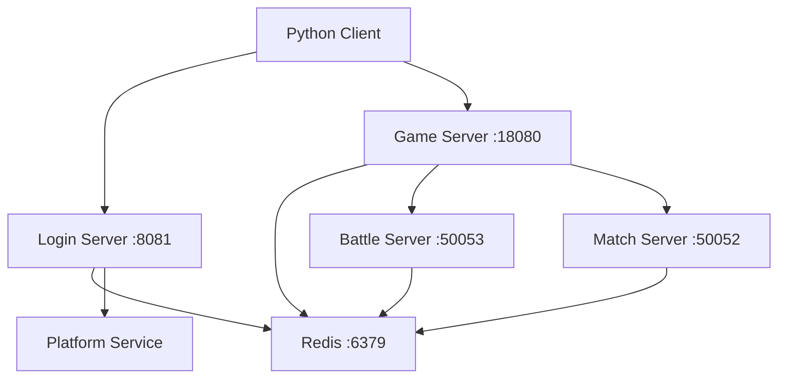

# Jigger Protobuf Server Docker 部署

## 概述

这个 Docker Compose 配置可以一键启动 Jigger Protobuf 游戏服务器的所有服务组件。

## 服务架构



## 包含的服务

| 服务名 | 端口 | 描述 |
|--------|------|------|
| Redis | 6379 | 共享数据存储 |
| Login Server | 8081 | 登录认证服务 |
| Game Server | 18080 (WebSocket), 12345 (TCP), 50051 (gRPC) | 游戏主服务 |
| Battle Server | 50053 (gRPC) | 战斗逻辑服务 |
| Match Server | 50052 (gRPC) | 匹配服务 |

## 快速开始

### 1. 启动所有服务

**Windows:**
```cmd
start-all.bat
```

**Linux/macOS:**
```bash
chmod +x start-all.sh
./start-all.sh
```

**手动启动:**
```bash
docker-compose up -d --build
```

### 2. 查看服务状态

```bash
docker-compose ps
```

### 3. 查看日志

**使用脚本 (Windows):**
```cmd
logs.bat
```

**手动查看:**
```bash
# 查看所有服务日志
docker-compose logs -f

# 查看特定服务日志
docker-compose logs -f game-server
docker-compose logs -f login-server
docker-compose logs -f redis
```

### 4. 停止所有服务

**Windows:**
```cmd
stop-all.bat
```

**手动停止:**
```bash
docker-compose down
```

## 服务配置

### 环境变量

每个服务都可以通过环境变量进行配置：

#### Login Server
- `REDIS_ADDR`: Redis地址 (默认: redis:6379)
- `PLATFORM_API`: 平台认证API地址
- `PORT`: 服务端口 (默认: 8081)

#### Game Server
- `REDIS_ADDR`: Redis地址 (默认: redis:6379)
- `PLATFORM_BASE_URL`: 平台服务基础URL
- `PLATFORM_INTERNAL_TOKEN`: 平台内部认证token

#### Battle Server
- `REDIS_ADDR`: Redis地址 (默认: redis:6379)
- `GRPC_PORT`: gRPC端口 (默认: 50053)

#### Match Server
- `REDIS_ADDR`: Redis地址 (默认: redis:6379)
- `GRPC_PORT`: gRPC端口 (默认: 50052)

## 健康检查

所有服务都配置了健康检查：

- **Redis**: 使用 `redis-cli ping`
- **Login Server**: HTTP GET /health
- **Game Server**: 检查端口连通性
- **Battle/Match Server**: gRPC连接检查

## 数据持久化

- **Redis数据**: 存储在 `redis_data` 卷中，数据不会因容器重启而丢失

## 网络配置

所有服务运行在 `jigger-network` 桥接网络中，服务间可以通过服务名相互访问。

## 故障排除

### 1. 服务启动失败

检查端口占用：
```bash
# Windows
netstat -an | findstr :8081
netstat -an | findstr :18080

# Linux/macOS
lsof -i :8081
lsof -i :18080
```

### 2. Redis连接失败

检查Redis服务状态：
```bash
docker-compose logs redis
docker exec jigger-redis redis-cli ping
```

### 3. 服务间通信问题

检查网络配置：
```bash
docker network ls
docker network inspect jigger_jigger-network
```

### 4. 构建失败

清理Docker缓存：
```bash
docker system prune -a
docker-compose build --no-cache
```

## 开发调试

### 进入容器调试

```bash
# 进入Redis容器
docker exec -it jigger-redis redis-cli

# 进入Game Server容器
docker exec -it jigger-game-server sh

# 查看容器内进程
docker exec jigger-game-server ps aux
```

### 实时日志监控

```bash
# 多个终端同时监控
docker-compose logs -f redis &
docker-compose logs -f game-server &
docker-compose logs -f login-server &
```

## 性能监控

### 查看资源使用情况

```bash
docker stats
```

### Redis监控

```bash
docker exec jigger-redis redis-cli info
docker exec jigger-redis redis-cli monitor
```

## 扩展配置

### 增加新服务

1. 在 `docker-compose.yml` 中添加新服务
2. 创建对应的 Dockerfile
3. 更新网络和依赖关系

### 修改端口映射

在 `docker-compose.yml` 的 `ports` 部分修改：
```yaml
ports:
  - "新端口:容器端口"
```

## 生产环境建议

1. **安全性**:
   - 修改默认密码和token
   - 使用Docker secrets管理敏感信息
   - 配置防火墙规则

2. **性能**:
   - 调整Redis内存配置
   - 增加资源限制
   - 使用SSD存储

3. **监控**:
   - 集成Prometheus + Grafana
   - 配置日志聚合系统
   - 设置告警机制

## 常用命令

```bash
# 重新构建特定服务
docker-compose build game-server

# 重启特定服务
docker-compose restart game-server

# 查看服务配置
docker-compose config

# 清理所有资源
docker-compose down -v --rmi all

# 查看镜像大小
docker images | grep jigger
```